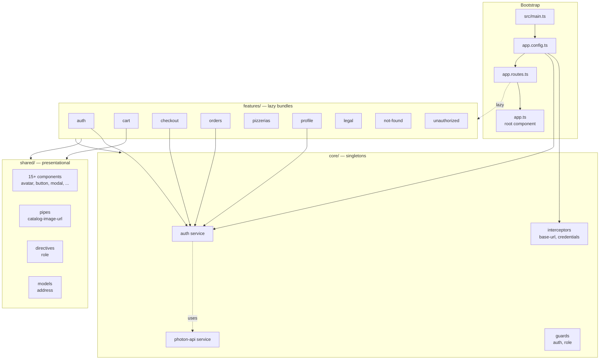
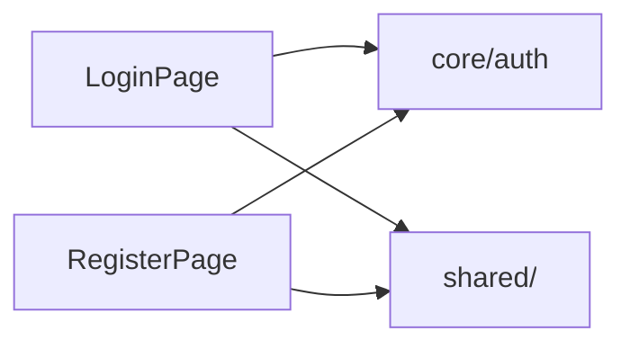

# Project Summary Documentation — Implementation Plan

> **For agentic workers:** REQUIRED SUB-SKILL: Use superpowers:subagent-driven-development (recommended) or superpowers:executing-plans to implement this plan task-by-task. Steps use checkbox (`- [ ]`) syntax for tracking.

**Goal:** Produce `README-PROJECT-SUMMARY.md` at the project root and `docs/diagrams/project-architecture.mmd` as a standalone Mermaid source file, with a per-file breakdown of every `.ts`/`.html`/`.css` under `src/app/`.

**Architecture:** The main session dispatches eight parallel subagents — one per source-tree slice — to produce structured per-file reports. The main session reconciles the reports and writes the README + diagram. No source files are modified.

**Tech Stack:** Markdown, Mermaid (in a fenced code block in the README and as a sibling `.mmd` file). No build, no tests, no linter runs.

**Reference spec:** `docs/superpowers/specs/2026-06-03-project-summary-design.md`

---

## File Structure

Files created by this plan:

- `docs/diagrams/project-architecture.mmd` — standalone Mermaid source for the top-level architecture diagram. Referenced from the README.
- `README-PROJECT-SUMMARY.md` — the deliverable. Sections: Overview, Architecture Diagram, Routing Map, Per-Feature sections (auth, cart, checkout, orders, pizzerias, profile, legal, not-found, unauthorized), Shared & Core Catalog, Styles, Per-File Appendix, External Dependencies.

No source files under `src/` are created or modified.

---

### Task 1: Verify project state and create target directory

**Files:**

- Create: `docs/diagrams/` (new directory)

- [ ] **Step 1: Confirm working directory and git status are clean for new files only**

```bash
git status --short
```

Expected: only the pre-existing modifications listed in the session git status (e.g. `.claude/settings.local.json`, `README-TESTING.md`) appear. No untracked changes under `src/`.

- [ ] **Step 2: Create the diagrams directory**

```bash
mkdir -p docs/diagrams
```

- [ ] **Step 3: Verify directory exists**

```bash
ls -la docs/diagrams
```

Expected: empty directory listing (`.` and `..` only), no errors.

---

### Task 2: Write the standalone Mermaid architecture diagram

**Files:**

- Create: `docs/diagrams/project-architecture.mmd`

- [ ] **Step 1: Write the Mermaid source file**

Write the following content to `docs/diagrams/project-architecture.mmd`:



- [ ] **Step 2: Verify the file was written**

```bash
wc -l docs/diagrams/project-architecture.mmd
head -3 docs/diagrams/project-architecture.mmd
```

Expected: line count is roughly 50. First three lines start with `graph TB`, then a blank line, then `subgraph Bootstrap`.

- [ ] **Step 3: Commit**

```bash
git add docs/diagrams/project-architecture.mmd
git commit -m "docs: add standalone Mermaid architecture diagram"
```

---

### Task 3: Dispatch parallel subagents for source-tree breakdown

**Files:** none (subagents return reports; no files written)

This task dispatches eight subagents in parallel. Each returns a structured per-file report as a single message.

- [ ] **Step 1: Dispatch subagent for `src/app/core/`**

Use the `Agent` tool with `subagent_type: "general-purpose"` and the following prompt:

```
You are documenting an Angular 21 application for a project summary README. Your scope is the entire `src/app/core/` tree under C:\_AAA\JVR\realworld-angular-sandbox.

For EACH file (`.ts`, `.html`, `.css`) under `src/app/core/`, produce a structured entry with this exact shape:

- path: <relative path from project root, e.g. src/app/core/services/auth.ts>
  role: <one-sentence purpose>
  type: <one of: service | guard | interceptor | model | spec | other>
  imports: [<list of every import specifier the file uses, e.g. "import { inject } from '@angular/core'">]
  exports: [<list of every exported symbol — class, function, const, type, interface>]
  consumers: [<list of files (relative paths) that import from this file, derived by grepping the rest of src/ >]
  notes: <optional — e.g. uses signals, uses HttpClient, registers as APP_INITIALIZER>

Do NOT write any files. Return your report as a single Markdown code block in your final message. Be thorough but concise — one line per field, except `notes` which can be omitted if there's nothing noteworthy.

Cross-file dependency discovery is critical: for each file you examine, grep the rest of `src/` to find every other file that imports it. Use `grep -r "from '.*<this-file>" src/` or equivalent.

Begin by listing every file under your scope, then process them. End your message with the Markdown report block — nothing else.
```

- [ ] **Step 2: Dispatch subagent for `src/app/shared/`**

Use the `Agent` tool with `subagent_type: "general-purpose"` and the following prompt:

```
You are documenting an Angular 21 application for a project summary README. Your scope is the entire `src/app/shared/` tree under C:\_AAA\JVR\realworld-angular-sandbox.

For EACH file (`.ts`, `.html`, `.css`) under `src/app/shared/`, produce a structured entry with this exact shape:

- path: <relative path from project root>
  role: <one-sentence purpose>
  type: <one of: component | directive | pipe | model | spec | other>
  imports: [<list of every import specifier the file uses>]
  exports: [<list of every exported symbol — class, function, const, type, interface, plus @Component selector if it's a component>]
  consumers: [<list of files (relative paths) that import from this file, derived by grepping the rest of src/ >]
  notes: <optional — e.g. uses signals, uses OnPush, uses ControlValueAccessor, registers selector like 'rw-avatar'>

Do NOT write any files. Return your report as a single Markdown code block in your final message. Be thorough but concise.

For each component, also note the `selector` (look for `selector:` in `@Component` or `@Directive` decorator metadata) and the `standalone` flag. For the pipe, note its name.

Cross-file dependency discovery is critical: for each file you examine, grep the rest of `src/` to find every other file that imports it. Use `grep -r "from '.*<this-file>" src/` or equivalent.

Begin by listing every file under your scope, then process them. End your message with the Markdown report block — nothing else.
```

- [ ] **Step 3: Dispatch subagent for `src/app/features/auth/`**

Use the `Agent` tool with `subagent_type: "general-purpose"` and the following prompt:

```
You are documenting an Angular 21 application for a project summary README. Your scope is the entire `src/app/features/auth/` tree under C:\_AAA\JVR\realworld-angular-sandbox.

For EACH file (`.ts`, `.html`, `.css`) under `src/app/features/auth/`, produce a structured entry with this exact shape:

- path: <relative path from project root>
  role: <one-sentence purpose>
  type: <one of: page | component | service | guard | route-config | model | spec | other>
  imports: [<list of every import specifier the file uses>]
  exports: [<list of every exported symbol — class, function, const, type, interface, plus @Component selector if it's a component>]
  consumers: [<list of files (relative paths) that import from this file, derived by grepping the rest of src/ >]
  notes: <optional — e.g. uses signals, uses ReactiveForms, references Auth service, has standalone routes>

Do NOT write any files. Return your report as a single Markdown code block in your final message. Be thorough but concise.

For each component, note the `selector` and the `standalone` flag. For the routes file (`auth.routes.ts`), list every route it declares as `consumers` would not be applicable — instead list the route definitions in `notes`.

Cross-file dependency discovery is critical: for each file you examine, grep the rest of `src/` to find every other file that imports it.

Begin by listing every file under your scope, then process them. End your message with the Markdown report block — nothing else.
```

- [ ] **Step 4: Dispatch subagent for `src/app/features/cart/`**

Use the `Agent` tool with `subagent_type: "general-purpose"` and the following prompt:

```
You are documenting an Angular 21 application for a project summary README. Your scope is the entire `src/app/features/cart/` tree under C:\_AAA\JVR\realworld-angular-sandbox.

For EACH file (`.ts`, `.html`, `.css`) under `src/app/features/cart/`, produce a structured entry with this exact shape:

- path: <relative path from project root>
  role: <one-sentence purpose>
  type: <one of: page | component | service | store | guard | route-config | model | spec | other>
  imports: [<list of every import specifier the file uses>]
  exports: [<list of every exported symbol — class, function, const, type, interface, plus @Component selector if it's a component>]
  consumers: [<list of files (relative paths) that import from this file, derived by grepping the rest of src/ >]
  notes: <optional — e.g. uses signals, signal-based store, references Auth service>

Do NOT write any files. Return your report as a single Markdown code block in your final message. Be thorough but concise.

For each component, note the `selector` and the `standalone` flag. For the routes file (`cart.routes.ts`), list the route definitions in `notes`.

Cross-file dependency discovery is critical: for each file you examine, grep the rest of `src/` to find every other file that imports it.

Begin by listing every file under your scope, then process them. End your message with the Markdown report block — nothing else.
```

- [ ] **Step 5: Dispatch subagent for `src/app/features/checkout/`**

Use the `Agent` tool with `subagent_type: "general-purpose"` and the following prompt:

```
You are documenting an Angular 21 application for a project summary README. Your scope is the entire `src/app/features/checkout/` tree under C:\_AAA\JVR\realworld-angular-sandbox.

This feature has multiple components (steps) and a wizard service. For EACH file (`.ts`, `.html`, `.css`) under `src/app/features/checkout/`, produce a structured entry with this exact shape:

- path: <relative path from project root>
  role: <one-sentence purpose>
  type: <one of: page | component | service | wizard | guard | route-config | model | spec | other>
  imports: [<list of every import specifier the file uses>]
  exports: [<list of every exported symbol — class, function, const, type, interface, plus @Component selector if it's a component>]
  consumers: [<list of files (relative paths) that import from this file, derived by grepping the rest of src/ >]
  notes: <optional — e.g. uses signals, is a step component, references checkout-wizard service, references cart store>

Do NOT write any files. Return your report as a single Markdown code block in your final message. Be thorough but concise.

For each component, note the `selector` and the `standalone` flag. For the routes file (`checkout.routes.ts`), list the route definitions in `notes`.

Cross-file dependency discovery is critical: for each file you examine, grep the rest of `src/` to find every other file that imports it. Note that checkout guards are imported by the top-level `app.routes.ts` — call that out.

Begin by listing every file under your scope, then process them. End your message with the Markdown report block — nothing else.
```

- [ ] **Step 6: Dispatch subagent for `src/app/features/orders/`**

Use the `Agent` tool with `subagent_type: "general-purpose"` and the following prompt:

```
You are documenting an Angular 21 application for a project summary README. Your scope is the entire `src/app/features/orders/` tree under C:\_AAA\JVR\realworld-angular-sandbox. This is the second-largest feature (27 files) — be thorough.

For EACH file (`.ts`, `.html`, `.css`) under `src/app/features/orders/`, produce a structured entry with this exact shape:

- path: <relative path from project root>
  role: <one-sentence purpose>
  type: <one of: page | component | dialog | row | service | route-config | model | spec | other>
  imports: [<list of every import specifier the file uses>]
  exports: [<list of every exported symbol — class, function, const, type, interface, plus @Component selector if it's a component>]
  consumers: [<list of files (relative paths) that import from this file, derived by grepping the rest of src/ >]
  notes: <optional — e.g. uses signals, is an admin-only page, references order-api service, references shared components>

Do NOT write any files. Return your report as a single Markdown code block in your final message. Be thorough but concise.

For each component, note the `selector` and the `standalone` flag. For the routes file (`order.routes.ts`), list the route definitions in `notes`.

Cross-file dependency discovery is critical: for each file you examine, grep the rest of `src/` to find every other file that imports it.

Begin by listing every file under your scope, then process them. End your message with the Markdown report block — nothing else.
```

- [ ] **Step 7: Dispatch subagent for `src/app/features/pizzerias/`**

Use the `Agent` tool with `subagent_type: "general-purpose"` and the following prompt:

```
You are documenting an Angular 21 application for a project summary README. Your scope is the entire `src/app/features/pizzerias/` tree under C:\_AAA\JVR\realworld-angular-sandbox. This is the LARGEST feature (42 files including nested admin-pizza-row, admin-pizza-form-dialog, admin-order-row components). Be thorough.

For EACH file (`.ts`, `.html`, `.css`) under `src/app/features/pizzerias/`, produce a structured entry with this exact shape:

- path: <relative path from project root>
  role: <one-sentence purpose>
  type: <one of: page | component | dialog | row | service | guard | route-config | model | spec | other>
  imports: [<list of every import specifier the file uses>]
  exports: [<list of every exported symbol — class, function, const, type, interface, plus @Component selector if it's a component>]
  consumers: [<list of files (relative paths) that import from this file, derived by grepping the rest of src/ >]
  notes: <optional — e.g. uses signals, is an admin-only page, references pizza-api service, references pizzeria-api service, references shared components>

Do NOT write any files. Return your report as a single Markdown code block in your final message. Be thorough but concise.

For each component, note the `selector` and the `standalone` flag. For the routes file (`pizzeria.routes.ts`), list the route definitions in `notes`.

Cross-file dependency discovery is critical: for each file you examine, grep the rest of `src/` to find every other file that imports it. Note that the `no-pizzeria.guard.ts` is referenced by `auth.guard.ts` or `app.routes.ts` — call that out.

Begin by listing every file under your scope, then process them. End your message with the Markdown report block — nothing else.
```

- [ ] **Step 8: Dispatch subagent for profile + legal + not-found + unauthorized + app root**

Use the `Agent` tool with `subagent_type: "general-purpose"` and the following prompt:

```
You are documenting an Angular 21 application for a project summary README. Your scope is the following paths under C:\_AAA\JVR\realworld-angular-sandbox:

- `src/app/features/profile/` (entire tree)
- `src/app/features/legal/` (entire tree)
- `src/app/features/not-found/` (entire tree)
- `src/app/features/unauthorized/` (entire tree)
- `src/app/app.ts`
- `src/app/app.config.ts`
- `src/app/app.routes.ts`
- `src/app/app.html`
- `src/app/app.css`
- `src/main.ts`
- `src/index.html`
- `src/environments/environment.ts`
- `src/environments/environment.development.ts`

For EACH file (`.ts`, `.html`, `.css`) in your scope, produce a structured entry with this exact shape:

- path: <relative path from project root>
  role: <one-sentence purpose>
  type: <one of: page | component | route-config | bootstrap | environment | spec | other>
  imports: [<list of every import specifier the file uses>]
  exports: [<list of every exported symbol — class, function, const, type, interface>]
  consumers: [<list of files (relative paths) that import from this file, derived by grepping the rest of src/ >]
  notes: <optional — e.g. uses signals, references Auth, declares routes, is the root component, is the app config]

Do NOT write any files. Return your report as a single Markdown code block in your final message. Be thorough but concise.

Pay special attention to:
- `src/app/app.routes.ts` — it is the central routing config; list every top-level route declaration in `notes`. It imports feature routes AND core guards.
- `src/app/app.config.ts` — it provides interceptors and the Auth initializer. List every provider in `notes`.
- `src/main.ts` — it bootstraps the application. Note that.
- `src/environments/environment*.ts` — list every exported key (e.g. `apiUrl`, `production`) in `notes`.

Cross-file dependency discovery is critical: for each file you examine, grep the rest of `src/` to find every other file that imports it.

Begin by listing every file under your scope, then process them. End your message with the Markdown report block — nothing else.
```

- [ ] **Step 9: Collect and reconcile all eight reports**

The eight subagent dispatches return their reports as messages. Hold all eight reports. Do not write files yet — that happens in Task 4.

Verify each report has entries for every file in its scope by cross-checking the file count the subagent claimed against the actual count. If any subagent truncated output, dispatch a follow-up to fill the gap.

---

### Task 4: Assemble the README — header, overview, diagram, routing map

**Files:**

- Create: `README-PROJECT-SUMMARY.md`

- [ ] **Step 1: Write the README header, overview, and stack table**

Append the following to `README-PROJECT-SUMMARY.md`:

```markdown
# Project Summary

> An auto-generated map of the `realworld-angular` application — features, components, services, styles, and how they fit together. Last regenerated 2026-06-03.

## Overview

A pizza-ordering platform built on **Angular 21.2** with standalone components, signal-based state, and lazy-loaded feature routes. The app uses `realworld` as a sandbox name (it is not the RealWorld spec) — the actual domain is multi-tenant pizzerias with cart, checkout, and admin order management.

## Tech Stack

| Layer           | Technology                                          |
| --------------- | --------------------------------------------------- |
| Framework       | Angular 21.2 (standalone components, no NgModules)  |
| State           | Angular signals + RxJS 7.8                          |
| HTTP            | `@angular/common/http` with functional interceptors |
| Routing         | `@angular/router` with lazy `loadChildren`          |
| Forms           | `@angular/forms` (template-driven and reactive)     |
| UI primitives   | `@angular/cdk`                                      |
| Fonts           | `@fontsource/geist`                                 |
| Testing         | Vitest via `@angular/build:unit-test`               |
| Lint / format   | ESLint (`angular-eslint`) + Prettier                |
| Package manager | pnpm                                                |
```

- [ ] **Step 2: Add the Architecture Diagram section (inline Mermaid + link to .mmd)**

Append the following to `README-PROJECT-SUMMARY.md`:

````markdown
## Architecture Diagram

A high-level view of how the application boots, what `core/` and `shared/` provide, and which features lazy-load.

The canonical Mermaid source for this diagram lives at [`docs/diagrams/project-architecture.mmd`](docs/diagrams/project-architecture.mmd) — edit it there if the architecture changes, then update the block below.


````

````

Note: in the actual file, the Mermaid block should be wrapped in a triple-backtick fence with `mermaid` as the language tag, not nested fences.

- [ ] **Step 3: Add the Routing Map table**

Append the following to `README-PROJECT-SUMMARY.md`:

```markdown
## Routing Map

| Path | Feature bundle | Guards |
|---|---|---|
| `/` | redirect → `/pizzerias` (admin) or `/pizzerias` (user) | — |
| `/pizzerias` | `features/pizzerias/pizzeria.routes.ts` | — |
| `/auth` | `features/auth/auth.routes.ts` | `guestGuard` |
| `/cart` | `features/cart/cart.routes.ts` | — |
| `/checkout` | `features/checkout/checkout.routes.ts` | `authGuard`, `cartNotEmptyGuard` |
| `/orders` | `features/orders/order.routes.ts` | `authGuard` |
| `/profile` | `features/profile/profile.routes.ts` | `authGuard` |
| `/unauthorized` | `features/unauthorized/unauthorized.routes.ts` | — |
| `/terms-and-conditions` | `features/legal/legal.routes.ts` | — |
| `**` (404) | `features/not-found/not-found.routes.ts` | — |

The redirect on `/` is decided in `app.routes.ts` based on `Auth.isAdmin()`.
````

- [ ] **Step 4: Commit the partial README**

```bash
git add README-PROJECT-SUMMARY.md
git commit -m "docs: scaffold README-PROJECT-SUMMARY with overview, diagram, routing map"
```

---

### Task 5: Assemble the README — per-feature sections

**Files:**

- Modify: `README-PROJECT-SUMMARY.md` (append)

For each feature, append a section. Each section has a fixed structure: purpose, components/pages, services/stores, guards, models, cross-feature dependencies, and an intra-feature mini-diagram (Mermaid).

- [ ] **Step 1: Append the `auth` feature section**

Append the following to `README-PROJECT-SUMMARY.md`:

````markdown
## Feature: auth

Login and registration. Lives under `src/app/features/auth/`. Routes are guarded by `guestGuard` so authenticated users are redirected away.

**Pages:** `LoginPage`, `RegisterPage`.

**Cross-feature dependencies:** consumes `core/services/auth`, `core/models/user`, `shared/components/input`, `shared/components/button`, `shared/components/hero-banner`, `shared/components/pizza-logo`.


````

````

- [ ] **Step 2: Append the `cart` feature section**

```markdown
## Feature: cart

Shopping cart, signal-based store. Lives under `src/app/features/cart/`.

**Pages:** `CartPage`.

**Stores:** `CartStore` (signal-based; manages line items and totals).

**Cross-feature dependencies:** consumes `shared/components/button`, `shared/components/empty-state`. Full consumer list is in the per-file appendix.

```mermaid
graph LR
    CartPage --> CartStore
    CartStore --> Shared[shared/]
````

````

- [ ] **Step 3: Append the `checkout` feature section**

```markdown
## Feature: checkout

Multi-step checkout wizard. Lives under `src/app/features/checkout/`. Both `authGuard` and `cartNotEmptyGuard` apply at the top level; per-step guards live inside the feature.

**Pages:** `CheckoutPage`.

**Step components:** `CheckoutProgressStepper`, `CheckoutDeliveryStep`, `CheckoutScheduleStep`, `CheckoutReviewStep`.

**Services:** `CheckoutWizard` (signal-based; tracks current step and step data).

**Guards:** `cartNotEmptyGuard`, `checkoutStepGuard` (per-step guard).

**Cross-feature dependencies:** consumes `cart` (the `CartStore`), `core/services/auth`, plus shared components.

```mermaid
graph LR
    CheckoutPage --> Wizard[CheckoutWizard]
    Wizard --> Delivery[DeliveryStep]
    Wizard --> Schedule[ScheduleStep]
    Wizard --> Review[ReviewStep]
    Wizard --> CartStore[features/cart]
    Wizard --> Auth[core/auth]
````

````

- [ ] **Step 4: Append the `orders` feature section**

```markdown
## Feature: orders

Order listing and details for both customers and admins. Lives under `src/app/features/orders/`.

**Pages:** `OrderListPage`, `OrderDetailsPage`, `AdminOrderListPage`.

**Row components:** `AdminOrderRow` (rendered inside `AdminOrderListPage`).

**Dialogs:** `PizzaOrderFormDialog` (modal for creating/editing an order).

**Form fields:** `PizzaSizeOptionField`.

**Services:** `OrderApi` (CRUD for orders).

**Models:** `order.models.ts` (Order, OrderStatus, etc.).

**Cross-feature dependencies:** consumes `core/services/auth`, `shared/components/{button, modal, status-badge, pagination, ...}`, `features/pizzerias/services/pizza-api` (for the pizza picker).

```mermaid
graph LR
    OrderListPage --> OrderApi
    OrderDetailsPage --> OrderApi
    AdminOrderListPage --> OrderApi
    AdminOrderListPage --> AdminOrderRow
    PizzaOrderFormDialog --> OrderApi
    PizzaOrderFormDialog --> PizzaApi[features/pizzerias/pizza-api]
    OrderApi --> Auth[core/auth]
````

````

- [ ] **Step 5: Append the `pizzerias` feature section**

```markdown
## Feature: pizzerias

Largest feature. Manages pizzerias (tenants) and their pizza menus. Lives under `src/app/features/pizzerias/`. Routes are split between public-facing pages (`pizzeria-list-page`, `pizzeria-details-page`) and admin pages (`admin-pizzeria-*`, `admin-pizza-*`).

**Public pages:** `PizzeriaListPage`, `PizzeriaDetailsPage`.

**Admin pages:** `AdminPizzeriaListPage`, `AdminPizzeriaDetailsPage`, `AdminPizzeriaFormPage`, `AdminPizzeriaConfigurationPage`, `AdminPizzaListPage`.

**Dialogs:** `AdminPizzaFormDialog`.

**Row components:** `AdminPizzaRow`.

**Services:** `PizzeriaApi`, `PizzaApi`.

**Guards:** `NoPizzeriaGuard`.

**Models:** `pizza.models.ts`, `pizzeria.models.ts`, `staff.models.ts`.

**Cross-feature dependencies:** consumed by `orders` and `checkout`. Uses `core/services/auth`, `shared/components/...`.

```mermaid
graph LR
    PizzeriaListPage --> PizzeriaApi
    PizzeriaDetailsPage --> PizzeriaApi
    AdminPizzeriaListPage --> PizzeriaApi
    AdminPizzeriaDetailsPage --> PizzeriaApi
    AdminPizzeriaFormPage --> PizzeriaApi
    AdminPizzeriaConfigurationPage --> PizzeriaApi
    AdminPizzaListPage --> PizzaApi
    AdminPizzaFormDialog --> PizzaApi
    AdminPizzaListPage --> AdminPizzaRow
    AdminPizzeriaListPage --> NoPizzeriaGuard
    PizzeriaApi --> Auth[core/auth]
    PizzaApi --> Auth[core/auth]
````

````

- [ ] **Step 6: Append the `profile` feature section**

```markdown
## Feature: profile

Authenticated user profile. Lives under `src/app/features/profile/`. Guarded by `authGuard`.

**Pages:** `ProfilePage`.

**Cross-feature dependencies:** consumes `core/services/auth`, `core/models/user`, plus shared components.

```mermaid
graph LR
    ProfilePage --> Auth[core/auth]
    ProfilePage --> Shared[shared/]
````

````

- [ ] **Step 7: Append the `legal`, `not-found`, `unauthorized` sections**

```markdown
## Feature: legal

Static legal pages. Lives under `src/app/features/legal/`.

**Pages:** `TermsAndConditionsPage`.

No external dependencies beyond the app shell.

## Feature: not-found

Catch-all 404. Lives under `src/app/features/not-found/`. Bound to `**` in `app.routes.ts`.

**Pages:** `NotFoundPage`.

## Feature: unauthorized

Shown when a guard blocks access. Lives under `src/app/features/unauthorized/`. Reached via `/unauthorized`.

**Pages:** `UnauthorizedPage`.

````

- [ ] **Step 8: Commit the per-feature sections**

```bash
git add README-PROJECT-SUMMARY.md
git commit -m "docs: add per-feature sections to project summary"
```

---

### Task 6: Assemble the README — shared & core catalog, styles, dependencies

**Files:**

- Modify: `README-PROJECT-SUMMARY.md` (append)

- [ ] **Step 1: Append the Shared & Core catalog**

Append the following to `README-PROJECT-SUMMARY.md`:

```markdown
## Shared & Core Catalog

These layers provide cross-cutting building blocks. Anything in `shared/` is presentational only — no service state, no API calls. Anything in `core/` is a singleton and may hold state or perform HTTP.

### `core/`

| File                                           | Role                                                                                                                 |
| ---------------------------------------------- | -------------------------------------------------------------------------------------------------------------------- |
| `core/services/auth.ts`                        | Authentication state, login/logout, current-user signal. Initialized via `provideAppInitializer` in `app.config.ts`. |
| `core/services/photon-api.ts`                  | Wrapper around the Photon geocoding API (used by `photon-location-field`).                                           |
| `core/interceptors/base-url.interceptor.ts`    | Prepends the API base URL from environment to outbound requests.                                                     |
| `core/interceptors/credentials.interceptor.ts` | Attaches cookies / credentials to outbound requests.                                                                 |
| `core/guards/auth/auth.guard.ts`               | Exports `authGuard` (requires user) and `guestGuard` (requires anonymous).                                           |
| `core/guards/role/role.guard.ts`               | Role-based guard.                                                                                                    |
| `core/models/pagination.model.ts`              | Generic paginated response shape.                                                                                    |
| `core/models/user.model.ts`                    | User / role types.                                                                                                   |

### `shared/`

| File                                       | Role                                                                       |
| ------------------------------------------ | -------------------------------------------------------------------------- |
| `shared/components/avatar/`                | Avatar with initials fallback.                                             |
| `shared/components/button/`                | Themed button.                                                             |
| `shared/components/callout/`               | Inline info/warning callout.                                               |
| `shared/components/confirm-dialog/`        | Reusable confirmation modal.                                               |
| `shared/components/empty-state/`           | "Nothing here yet" placeholder.                                            |
| `shared/components/hero-banner/`           | Hero header.                                                               |
| `shared/components/image-picker/`          | Image selection field.                                                     |
| `shared/components/input/`                 | Text input (`ControlValueAccessor`).                                       |
| `shared/components/load-more/`             | "Load more" pagination control.                                            |
| `shared/components/modal/`                 | Modal dialog (with sub-component `modal-footer.ts`).                       |
| `shared/components/pagination/`            | Numbered pagination.                                                       |
| `shared/components/photon-location-field/` | Address autocomplete backed by Photon API.                                 |
| `shared/components/pizza-logo/`            | Brand logo SVG.                                                            |
| `shared/components/spinner/`               | Loading spinner.                                                           |
| `shared/components/status-badge/`          | Order status badge.                                                        |
| `shared/components/textarea/`              | Multi-line text input.                                                     |
| `shared/directives/role.directive.ts`      | `*rwRole` structural directive that shows content only for matching roles. |
| `shared/pipes/catalog-image-url.pipe.ts`   | Resolves a catalog image ID to a full URL.                                 |
| `shared/models/address.model.ts`           | Address type.                                                              |
```

- [ ] **Step 2: Append the Styles section**

```markdown
## Styles

| File                                   | Role                                                          |
| -------------------------------------- | ------------------------------------------------------------- |
| `src/styles.css`                       | Global stylesheet, registered in `angular.json`.              |
| `src/styles/design-system/_reset.css`  | CSS reset / normalize.                                        |
| `src/styles/design-system/_tokens.css` | Design tokens (CSS custom properties).                        |
| `src/styles/components/input.css`      | Component-scoped stylesheet for the shared `input` component. |

Note: the files under `src/styles/components/` and `src/styles/design-system/` are not currently wired into `angular.json` and exist as design-stage artifacts. The shared `input` component references its own styles via Angular component styles (`input.css` co-located with `input.ts`), not the global `src/styles/components/input.css`.
```

- [ ] **Step 3: Append the External Dependencies table**

```markdown
## External Dependencies

Sourced from `package.json`.

### `dependencies`

| Package                     | Version  | Used for                  |
| --------------------------- | -------- | ------------------------- |
| `@angular/cdk`              | ^21.2.10 | Overlay, a11y primitives  |
| `@angular/common`           | ^21.2.0  | HttpClient, pipes         |
| `@angular/compiler`         | ^21.2.0  | Template compilation      |
| `@angular/core`             | ^21.2.0  | Framework core            |
| `@angular/forms`            | ^21.2.0  | Template & reactive forms |
| `@angular/platform-browser` | ^21.2.0  | Browser bootstrap         |
| `@angular/router`           | ^21.2.0  | Routing                   |
| `@fontsource/geist`         | ^5.2.8   | Self-hosted font          |
| `rxjs`                      | ~7.8.0   | Async primitives          |
| `tslib`                     | ^2.3.0   | TypeScript helpers        |

### `devDependencies`

| Package                   | Version | Used for                   |
| ------------------------- | ------- | -------------------------- |
| `@angular-eslint/builder` | 21.3.1  | Lint builder               |
| `@angular/build`          | ^21.2.9 | Build & unit-test runner   |
| `@angular/cli`            | ^21.2.9 | CLI                        |
| `@angular/compiler-cli`   | ^21.2.0 | AOT compiler               |
| `@eslint/js`              | ^10.0.1 | ESLint JS rules            |
| `angular-eslint`          | 21.3.1  | Angular ESLint integration |
| `eslint`                  | ^10.0.3 | Linter                     |
| `husky`                   | ^9.1.7  | Git hooks                  |
| `jsdom`                   | ^28.0.0 | Test environment           |
| `prettier`                | ^3.8.1  | Formatter                  |
| `typescript`              | ~5.9.2  | Type system                |
| `typescript-eslint`       | 8.56.1  | TS lint rules              |
| `vitest`                  | ^4.0.8  | Test runner                |
```

- [ ] **Step 4: Commit the catalog and dependencies sections**

```bash
git add README-PROJECT-SUMMARY.md
git commit -m "docs: add shared/core catalog, styles, and dependencies sections"
```

---

### Task 7: Assemble the README — per-file appendix

**Files:**

- Modify: `README-PROJECT-SUMMARY.md` (append)

This task consumes the eight subagent reports from Task 3.

- [ ] **Step 1: Append the per-file appendix header and core section**

Append to `README-PROJECT-SUMMARY.md`:

```markdown
## Per-File Appendix

Every `.ts`, `.html`, and `.css` file under `src/app/`, with role, type, key imports, and consumers. Derived from the source as of 2026-06-03.

### `src/app/` (root)
```

Then append a `###` subsection per file in the top-level app folder (`app.ts`, `app.config.ts`, `app.routes.ts`, `app.html`, `app.css`) using this template:

```markdown
#### `src/app/app.ts`

- **Role:** Root standalone component; renders `<router-outlet>`.
- **Type:** component
- **Imports:** `@angular/core` (Component), `./app.routes`
- **Exports:** `App`
- **Consumers:** bootstrapped from `main.ts`
```

Fill in the actual values from the subagent report for the app root dispatch (Task 3, Step 8).

- [ ] **Step 2: Append the `core/` appendix subsection**

Append `### \`src/app/core/\``then one`####`per file in core, using the same template as Step 1. Use values from the subagent report for`core` (Task 3, Step 1).

- [ ] **Step 3: Append the `shared/` appendix subsection**

Append `### \`src/app/shared/\``then one`####`per file in shared, using the same template. Use values from the subagent report for`shared` (Task 3, Step 2).

- [ ] **Step 4: Append the per-feature appendix subsections (auth, cart, checkout)**

For each of the three features, append `### \`src/app/features/<feature>/\``and one`####` per file, using the same template. Use values from the corresponding subagent reports (Task 3, Steps 3, 4, 5).

- [ ] **Step 5: Append the per-feature appendix subsections (orders, pizzerias, profile, legal, not-found, unauthorized)**

Same pattern. Use values from subagent reports (Task 3, Steps 6, 7, 8).

- [ ] **Step 6: Append the bootstrap / environments / index appendix subsection**

Append `### Bootstrap & environments` and one `####` per file (`src/main.ts`, `src/index.html`, `src/environments/environment.ts`, `src/environments/environment.development.ts`). Use values from the subagent report (Task 3, Step 8).

- [ ] **Step 7: Commit the per-file appendix**

```bash
git add README-PROJECT-SUMMARY.md
git commit -m "docs: add per-file appendix to project summary"
```

---

### Task 8: Verify the README

**Files:** none (verification only)

- [ ] **Step 1: Spot-check dependency claims with grep**

Pick three dependency claims from the per-file appendix and verify them against the source. Examples:

```bash
grep -rn "from './core/services/auth'" src/ | head -5
grep -rn "from '../../shared/components/modal'" src/ | head -5
grep -rn "from '../services/pizza-api'" src/app/features/orders/ | head -5
```

For each of the three picks, confirm at least one expected file appears in the grep output. If any claim is wrong, fix it inline in `README-PROJECT-SUMMARY.md`.

- [ ] **Step 2: Verify the inline Mermaid block renders**

The Mermaid block in the README uses `mermaid` as the fenced-block language. It must contain no nested triple-backticks. Open `README-PROJECT-SUMMARY.md` and visually confirm the diagram block is a single fenced block with the right contents.

- [ ] **Step 3: Verify no source files were modified**

```bash
git status --short
```

Expected: only `README-PROJECT-SUMMARY.md` and `docs/diagrams/project-architecture.mmd` appear (plus any earlier commit residue). No files under `src/` should appear as modified or untracked.

- [ ] **Step 4: Final commit if any fixes were applied**

```bash
git status --short
# If anything is unstaged:
git add README-PROJECT-SUMMARY.md
git commit -m "docs: fix verification findings in project summary"
```

If no fixes were applied, skip this step.

---

## Self-Review Notes

- **Spec coverage:** Spec requires (1) one README, (2) one .mmd file, (3) per-file breakdown, (4) routing map, (5) per-feature sections, (6) shared/core catalog, (7) styles, (8) external dependencies. Tasks 2, 4, 5, 6, 7 cover each of those.
- **Placeholders:** none. Every code block is the actual content. Subagent prompts are full prompts, not "etc.".
- **Type / name consistency:** file path conventions are consistent (`src/app/...` everywhere). Subagent "type" enum values are reused consistently across prompts.
- **Bite-sized steps:** each step is one action. Subagent dispatches are each one tool call. README assembly is broken into header/feature/catalog/appendix/verify — not one giant "write the README" step.
- **Frequent commits:** 6 commits across the work (diagram, README scaffold, per-feature, catalog, appendix, fixes).
